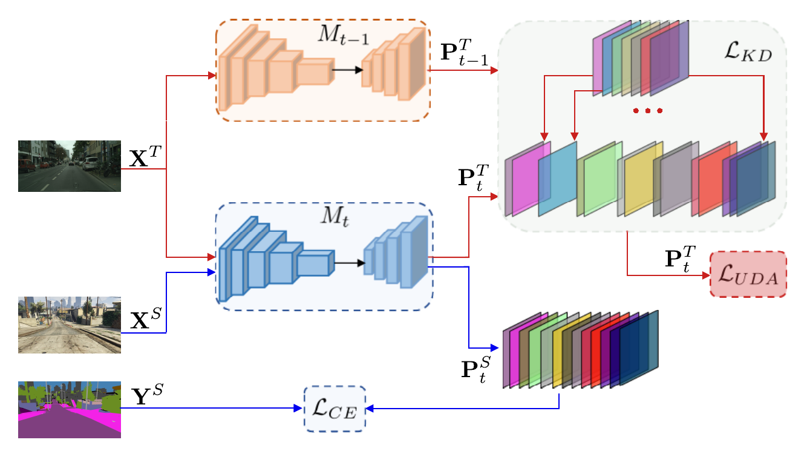

# Continual Coarse-to-Fine Domain Adaption in Semantic Segmentation 

<div align="center">

[](https://arxiv.org/abs/2201.06974)
[](https://www.sciencedirect.com/science/article/abs/pii/S0262885622000555)
[](img/poster.pdf)
[](#Citation)

</div>

Official PyTorch implementation of our work: “Continual coarse-to-fine domain adaptation in semantic segmentation”, published in Elsevier Image and Vision Computing, Volume 121, May 2022.

Corresponding author: donald.shenaj@dei.unipd.it

<p align="center">

</p>

## Requirements
This repository uses the following libraries:
- Python (3.7.11) [tested up to 3.9.7]
- PyTorch (1.10.0) [tested up to 1.10.1]
- torchvision (0.11.1) [tested up to 0.11.2]
- tensorboardX (2.4) [tested up to 2.4.1]
- opencv (4.5.4-dev) [tested up to 4.5.5]
- numpy (1.21.2) 
- pillow (8.4.0) 
- tqdm (4.62.3) 

All the dependencies are listed in the requirements.txt.
To install the requirements:
```sh
pip install -r requirements.txt
```

## Setup Dataset
#### GTA5
Download the [GTA5](https://download.visinf.tu-darmstadt.de/data/from_games/) dataset and place it inside the folder `${dataset_root}/GTA`. The dataset split is provided within the train.txt and val.txt files in the folder `datasets/splits/GTA`.

### Cityscapes
Download the [Cityscapes](https://www.cityscapes-dataset.com/) dataset (fine and coarse) and place it inside the folder `${dataset_root}/Cityscapes`.  The dataset split is provided within the train.txt, val.txt and test.txt files in the folder `datasets/splits/Cityscapes`.

### IDD
Download the [IDD](https://idd.insaan.iiit.ac.in/dataset/details/) dataset and place it inside the folder`${dataset_root}/IDD`. The dataset split is provided within the train.txt, val.txt and test.txt files in the folder `datasets/splits/IDD`.

### ResNet101 Weights
Download the official PyTorch ResNet101's weights pretrained on ImageNet from [here](https://download.pytorch.org/models/resnet101-5d3b4d8f.pth) and place them inside the folder `models/backbone_checkpoints`.

## Training Coarse-to-Fine

### GTA5-to-Cityscapes

- Source Only
```sh
python -u train.py --logdir "log/c2f/gta_to_cityscapes/source_only" --incremental_setup "c2f" --classifier "DeepLabV3" --blur_mul 5 --backbone "ResNet101" --incremental_iterations 25000 --dataloader_workers 4 --c2f_weight_init False --kd_lambda 0 --kd_lambda_c2f 0 --msiw_lambda 0 --validate_every_steps 2500 --batch_size 2 --source_dataset "gta" --target_dataset "cityscapes" --source_root_path "${dataset_root}/GTA" --source_splits_path "datasets/splits/GTA" --target_root_path "${dataset_root}/Cityscapes" --target_splits_path "datasets/splits/Cityscapes" 
```
- SKDC
```sh
python -u train.py --logdir "log/c2f/gta_to_cityscapes/skdc" --incremental_setup "c2f" --classifier "DeepLabV3" --blur_mul 5 --backbone "ResNet101" --incremental_iterations 25000 --dataloader_workers 4 --c2f_weight_init True --kd_lambda 10 --kd_lambda_c2f 10 --msiw_lambda 0 --kd_type "kdc" --validate_every_steps 2500 --batch_size 2 --source_dataset "gta" --target_dataset "cityscapes" --source_root_path "${dataset_root}/GTA" --source_splits_path "datasets/splits/GTA" --target_root_path "${dataset_root}/Cityscapes" --target_splits_path "datasets/splits/Cityscapes" 
```
- CCDA
```sh
python -u train.py --logdir "log/c2f/gta_to_cityscapes/ccda" --incremental_setup "c2f" --classifier "DeepLabV3" --blur_mul 5 --backbone "ResNet101" --incremental_iterations 25000 --dataloader_workers 4 --c2f_weight_init True --kd_lambda 10 --kd_lambda_c2f 10 --msiw_lambda 0.1 --uda_skip_iterations 100 --kd_type "kdc" --validate_every_steps 2500 --batch_size 2 --source_dataset "gta" --target_dataset "cityscapes" --source_root_path "${dataset_root}/GTA" --source_splits_path "datasets/splits/GTA" --target_root_path "${dataset_root}/Cityscapes" --target_splits_path "datasets/splits/Cityscapes" 
```

### GTA5-to-IDD
- Source Only
```sh
python -u train.py --logdir "log/c2f/gta_to_IDD/source_only" --incremental_setup "c2f" --classifier "DeepLabV3" --blur_mul 5 --backbone "ResNet101" --incremental_iterations 25000 --dataloader_workers 4 --c2f_weight_init False --kd_lambda 0 --kd_lambda_c2f 0 --msiw_lambda 0  --validate_every_steps 2500 --batch_size 1 --source_dataset "gta" --target_dataset "IDD" --source_root_path "${dataset_root}/GTA" --source_splits_path "datasets/splits/GTA" --source_rescale_size  "1280,720" --target_rescale_size "1280,720" --target_root_path "${dataset_root}/IDD" --target_splits_path "datasets/splits/IDD" 
```
- SKDC
```sh
python -u train.py --logdir "log/c2f/gta_to_IDD/skdc" --incremental_setup "c2f" --classifier "DeepLabV3" --blur_mul 5 --backbone "ResNet101" --incremental_iterations 25000 --dataloader_workers 4 --c2f_weight_init True --kd_lambda 10 --kd_lambda_c2f 1 --msiw_lambda 0 --kd_type "kdc" --validate_every_steps 2500 --batch_size 1 --source_dataset "gta" --target_dataset "IDD" --source_root_path "${dataset_root}/GTA" --source_splits_path "datasets/splits/GTA" --source_rescale_size  "1280,720" --target_rescale_size "1280,720" --target_root_path "${dataset_root}/IDD" --target_splits_path "datasets/splits/IDD" 
```
- CCDA
```sh
python -u train.py --logdir "log/c2f/gta_to_IDD/ccda" --incremental_setup "c2f" --classifier "DeepLabV3" --blur_mul 5 --backbone "ResNet101" --incremental_iterations 25000 --dataloader_workers 4 --c2f_weight_init True --kd_lambda 10 --kd_lambda_c2f 1 --msiw_lambda 0.1 --uda_skip_iterations 100 --kd_type "kdc" --validate_every_steps 2500 --batch_size 1 --source_dataset "gta" --target_dataset "IDD" --source_root_path "${dataset_root}/GTA" --source_splits_path "datasets/splits/GTA" --source_rescale_size  "1280,720" --target_rescale_size "1280,720" --target_root_path "${dataset_root}/IDD" --target_splits_path "datasets/splits/IDD" 
```

## Evaluation (example)

### GTA5-to-Cityscapes
```sh
python -u test.py --logdir "$train_path/test" --step_model_checkpoint "${train_path}/ResNet101_DeepLabV3_step0.pth" --incremental_setup "c2f" --classifier "DeepLabV3" --backbone "ResNet101" --batch_size 1 --target_val_split "test" --target_dataset "cityscapes" --target_root_path "${dataset_root}/Cityscapes" --target_splits_path "datasets/splits/Cityscapes" 
```

### GTA5-to-IDD
```sh
python -u test.py --logdir "$train_path/test" --step_model_checkpoint "${train_path}/ResNet101_DeepLabV3_step0.pth" --incremental_setup "c2f" --classifier "DeepLabV3" --backbone "ResNet101" --batch_size 1 --target_val_split "test" --target_rescale_size "1280,720" --target_dataset "IDD" --target_root_path "${dataset_root}/IDD" --target_splits_path "datasets/IDD/splits"  
```
<a name="Citation"></a>
## Cite us
If you find our work relevant to your research and you use this repository, please consider to cite:

```
@article{shenaj2022continual,
title = {Continual coarse-to-fine domain adaptation in semantic segmentation},
author = {Donald Shenaj and Francesco Barbato and Umberto Michieli and Pietro Zanuttigh},
journal = {Image and Vision Computing},
volume = {121},
pages = {104426},
year = {2022}
}
```
